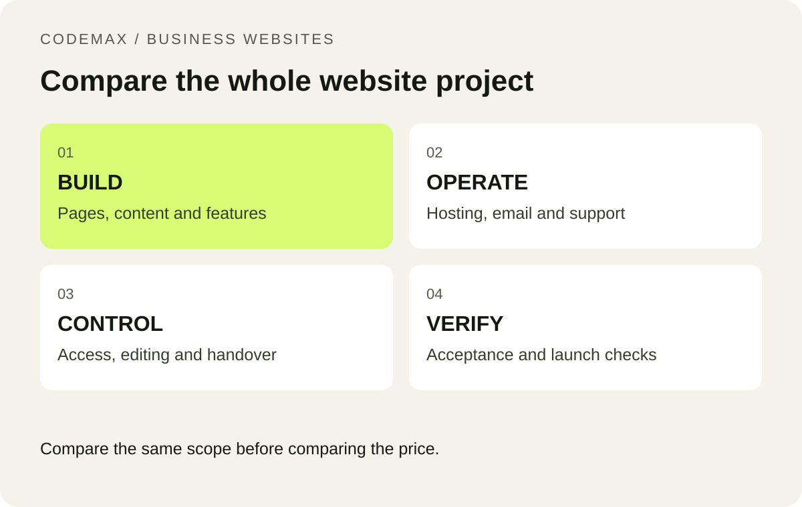

# Two Website Quotes, Two Very Different Prices: What to Compare

Scheduled: 2026-10-02 from 9 am Melbourne time.

Primary keyword: compare website quotes Melbourne

Related terms: small business website quote, website project scope Australia

SEO title: How to Compare Website Quotes in Melbourne | CodeMax

Meta description: Compare website quotes using scope, ownership, content, support and recurring costs before choosing a designer for your Australian business.

One website quote arrives as a single price. Another contains six pages of inclusions. Comparing the totals will not tell you whether they cover the same job. The useful comparison starts with what will be delivered, what you must supply and what you will still need to pay for after launch. Here is a practical way to turn competing proposals into a decision.

*Compare the same scope before comparing the price.*

## Write the same brief for every supplier

List the pages, customer actions and integrations you need. “Five-page website” is not enough if one supplier assumes a brochure and another includes booking, copywriting and migration. Name the required pages and give one sentence explaining the job of each. Specify whether existing blog posts and images must be retained.

Use a realistic example: a Melbourne service business may need service pages, a service-area explanation, approved project photographs and a quote form. An online shop may also need product entry, delivery settings and payment testing. These are different scopes even when the visual design looks equally simple.

## Compare deliverables line by line

Make a table with rows for design, copy, imagery, development, accessibility checks, contact forms, migration and launch support. For each quote, mark included, excluded or unclear. Ask for clarification of “SEO included”: does that mean metadata and redirects, content research, reporting or ongoing work? Each is a separate activity.

Also record revision rounds and the approval process. If you provide feedback late, what happens to the timeline? If the first design direction changes, is that covered? Clear boundaries reduce the chance that a cheap initial quote becomes an expensive disagreement.

## Calculate the cost beyond launch

Compare the first year and a typical renewal year. Separate the build fee from domain renewal, hosting, email, software subscriptions, maintenance and content changes. Business.gov.au treats domain names and hosting as separate elements of setting up a website; your proposal should make the same distinction clear.

Use your own quoted numbers rather than a generic market average. For example, a lower build price combined with several required subscriptions may suit you, but only if you understand the commitment. Ask who pays each supplier and what happens if a subscription ends.

## Ask for a handover demonstration

Before signing, request a description of what you will receive: account access, files where applicable, editing instructions and an exit process. Confirm whether you can move the website and whether any elements depend on a proprietary platform. These questions are about operational fit, not about assuming one technology is always better.

Finally, choose the quote that explains how the website will support your customers and your team. A useful proposal makes responsibilities visible. Keep the comparison sheet after launch so you can check delivery against the agreed scope rather than relying on memory.

## Put this into practice

A useful website brief starts with a real customer task, a realistic scope and a clear next step. [Explore how CodeMax can help](/services/web-design-melbourne/), or [send us your website and the problem you want to solve](/#enquiry).

## Sources and further reading

[business.gov.au: Set up a business website](https://business.gov.au/online-and-digital/business-website/set-up-a-business-website). Checked 30 September 2026.
