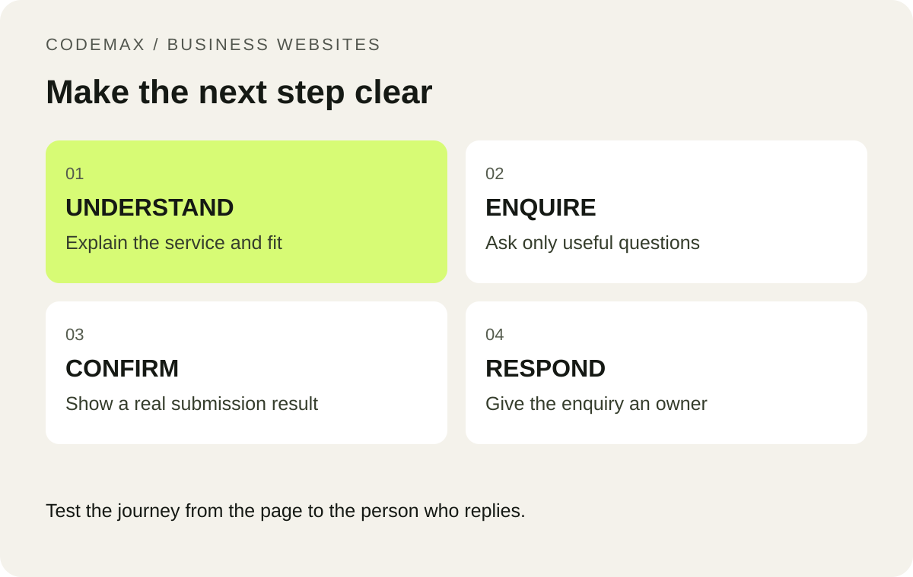

# Your Website Gets Visits. Is the Enquiry Form Losing Customers?

Scheduled: 2026-10-03 from 9 am Melbourne time.

Primary keyword: small business website enquiry form

Related terms: website enquiries Melbourne, business contact form checklist

SEO title: Small Business Enquiry Forms: Stop Losing Customers | CodeMax

Meta description: Use this small business enquiry form checklist to collect useful details, reduce confusion and make mobile enquiries easier to complete.

A potential customer should not have to complete a procurement questionnaire to ask for help. At the same time, a small business needs enough information to decide whether an enquiry fits its services and availability. A good enquiry form balances those needs. The goal is a useful conversation, with fewer unnecessary steps between the visitor and your team.

*Test the journey from the page to the person who replies.*

## Explain when to call and when to use the form

Put the phone number beside a clear explanation of when your team answers calls. Routine project questions and quote requests can use the enquiry form. Explain that submitting it requests contact; it does not confirm a booking.

This distinction matters when someone submits a form after hours. If your team will reply on the next business day, say so near the button. Avoid a vague “We will be in touch shortly” message that creates an expectation you cannot reliably meet.

## Ask for the details that change the response

A practical starting set is name, contact method, suburb and a short description of the job. You can offer a small list of service types, but include a sensible fallback when the customer does not know the technical term. Consider optional photographs only if you have a secure upload process and a team ready to review them.

Do not require a full street address just to decide whether an enquiry is in your service area. Ask for additional details later when necessary. Review each field with the question: would this answer change how we handle the first response? If not, it may not belong on the initial form.

## Test with one hand on a phone

Open the page on a real phone, enlarge the text and complete the form. Can you read labels after typing? Can you reach the submit button without dismissing several pop-ups? Does the form retain your message after an error? These checks often expose problems that a desktop screenshot misses.

W3C’s forms guidance recommends clearly associated labels and understandable instructions. Use visible labels rather than relying entirely on placeholder text. Errors should identify the field and explain how to correct it. A generic red outline is not enough information.

## Follow an enquiry all the way to the inbox

Run a test with your team and confirm who receives it, how it is identified and how quickly someone can respond. Check the reply address and make sure a successful submission message appears only after the server accepts the request. Test an invalid email and a temporary delivery failure as well.

Keep a lightweight enquiry log for a week: received, relevant, contacted and booked. It will help distinguish a form problem from a lead-quality or follow-up problem. Do not promise a particular increase in jobs from a new form; use your own results to decide what to improve next.

## Put this into practice

A useful website brief starts with a real customer task, a realistic scope and a clear next step. [Explore how CodeMax can help](/services/web-design-melbourne/), or [send us your website and the problem you want to solve](/#enquiry).

## Sources and further reading

[W3C Web Accessibility Initiative: Forms tutorial](https://www.w3.org/WAI/tutorials/forms/). Checked 30 September 2026.
