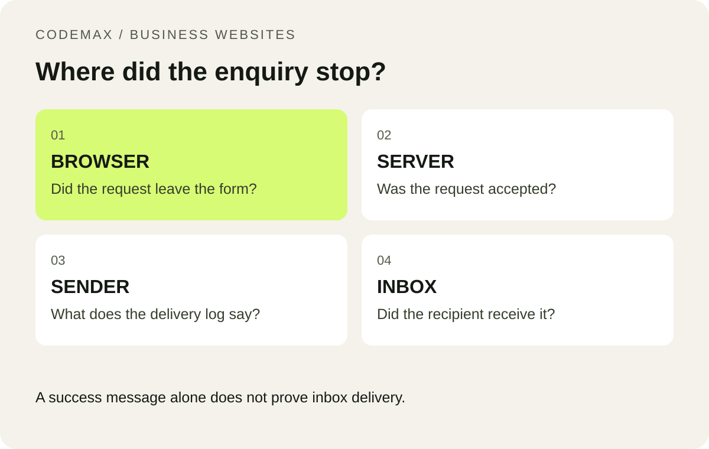

# The Form Says “Sent”, but No Email Arrives: A Troubleshooting Guide

Scheduled: 2026-10-07 from 9 am Melbourne time.

Primary keyword: website contact form not sending email

Related terms: contact form email delivery, website enquiry form troubleshooting

SEO title: Contact Form Sent but No Email? Troubleshooting Guide | CodeMax

Meta description: Trace a missing website enquiry from browser to inbox and learn why a success message does not always mean the email was delivered.

You submit a test enquiry, see a success message and assume the contact form works. Later, nobody can find the email. The fault may be in the form, its server, the sending service or the receiving mailbox. Testing those stages separately gives you a much better starting point than repeatedly changing the recipient address.

*A success message alone does not prove inbox delivery.*

## Record one controlled test

Use a unique subject or message, record the time and note which page you used. Keep the test free of customer information. Ask the recipient to check their inbox and spam folder, then inspect the sending service’s log if you have access. Repeated unlabelled tests make it harder to identify which event belongs to which attempt.

Do not paste API keys, secret tokens or raw customer messages into a public support request. A developer usually needs the timestamp, error category and a redacted request identifier to begin tracing the failure.

## Check what “success” actually means

The browser should show success only after the server accepts the submission. A form that displays a thank-you message immediately when the button is clicked may be hiding an error. Open the browser’s network tools or ask your developer to inspect the response from the form endpoint.

Even a successful sending API response is not proof that a person received the message. Delivery systems can report later outcomes, and an accepted message may still be filtered by the receiving provider. Resend’s delivery details are an example of the logs that help separate these stages.

## Check configuration in the running environment

Confirm that production has the correct recipient, approved sending address and sending credentials. Settings used during a build may not be available to the server that handles a form at runtime. Preview and production environments can also have different values. Check the deployed system rather than relying on a screenshot from an earlier setup.

If the form uses a security challenge, verify its server-side result and allowed website addresses. Cloudflare’s Turnstile documentation requires server-side token validation. A visible widget alone does not complete the integration. Expired or reused tokens should lead to a clear retry message.

## Make future failures visible

Provide a useful error message and an alternative phone or email contact when delivery fails. Keep operational logs that identify errors without unnecessarily storing the full enquiry. Decide who receives alerts and who owns a repair when the form stops working.

After a fix, test a normal submission, an invalid input and a rejected security check. Confirm the reply address as well as receipt. A small, repeatable test after deployments is more valuable than assuming the form will keep working because it worked once at launch.

## Put this into practice

Share the affected page and what happened so a website review can focus on the actual failure. [Explore how CodeMax can help](/services/website-maintenance-melbourne/), or [send us your website and the problem you want to solve](/#enquiry).

## Sources and further reading

[Resend: Improved bounced and delivery details](https://www.resend.com/changelog/improved-bounced-and-delivery-details). Checked 30 September 2026.

[Cloudflare: Validate a Turnstile token on the server](https://developers.cloudflare.com/turnstile/get-started/server-side-validation/).
