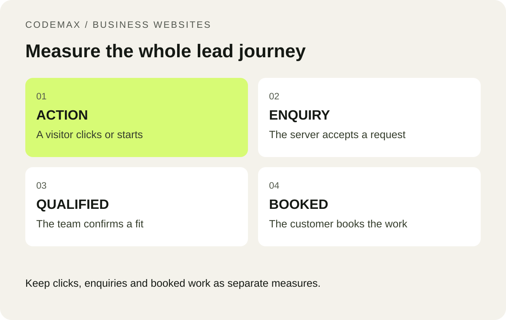

# Your Website Has Traffic. How Many Real Enquiries Does It Generate?

Scheduled: 2026-10-14 from 9 am Melbourne time.

Primary keyword: track website enquiries GA4

Related terms: measure website leads, small business website conversion tracking

SEO title: How to Measure Real Website Enquiries | CodeMax

Meta description: Build a simple measurement plan for website enquiries, separating button clicks, accepted forms, qualified leads and booked work.

Page views describe activity, but they do not tell you how many useful conversations your website creates. A business can receive more visits while its enquiry quality stays unchanged. A small measurement plan connects website actions with the outcomes your team cares about, without requiring a complicated dashboard.

*Keep clicks, enquiries and booked work as separate measures.*

## Define the stages before choosing a tool

Use four stages: an action starts, an enquiry is accepted, the team qualifies it and a job is booked. A telephone-link click belongs at the first stage because it does not prove a call connected. A form-button click also does not prove the server accepted the message.

Write a definition for each stage and agree it with the person handling enquiries. Decide how duplicates, spam and existing-customer support requests are treated. These definitions matter because a report can look better simply because the meaning of “lead” changed.

## Measure the successful form event

Google Analytics lists generate_lead as a recommended event for submissions or requests for information. When implementing it, connect the event to the successful outcome you have defined rather than every button press. Test that it does not fire repeatedly when someone reloads a confirmation page.

Do not send names, email addresses, phone numbers or free-text enquiry messages as analytics parameters. Keep reporting focused on non-identifying categories such as the service selected, where appropriate. Review your analytics and consent arrangements for your actual business circumstances.

## Reconcile analytics with the enquiry process

Compare recorded successful submissions with the messages received by your team over a short period. They may not match perfectly because of consent choices, blockers and implementation differences. Investigate substantial discrepancies rather than silently treating either count as unquestionable.

Maintain a simple operational log with date, service, source if known, qualification and outcome. Avoid collecting extra personal information just to improve a chart. The purpose is to see whether relevant enquiries become conversations and booked work, not to track every possible action.

## Use the results to choose one improvement

If many visitors start a form but few complete it, investigate the form. If submissions arrive but most are outside your service area, review the page’s wording and traffic sources. If qualified enquiries are not contacted promptly, the next improvement may be in the response process.

Review the same definitions each month and annotate website changes. Small businesses may have too few enquiries to support confident short-term comparisons, so use the numbers alongside actual customer feedback. A clear measurement plan helps you ask better questions before spending money on more traffic.

## Put this into practice

Start with a defined question and a small set of pages so the review produces decisions you can act on. [Explore how CodeMax can help](/services/website-analysis-melbourne/), or [send us your website and the problem you want to solve](/#enquiry).

## Sources and further reading

[Google Analytics Help: Recommended events](https://support.google.com/analytics/answer/9267735?hl=en). Checked 30 September 2026.

[Google Analytics: Avoid sending personally identifiable information](https://support.google.com/analytics/answer/6366371?hl=en).
