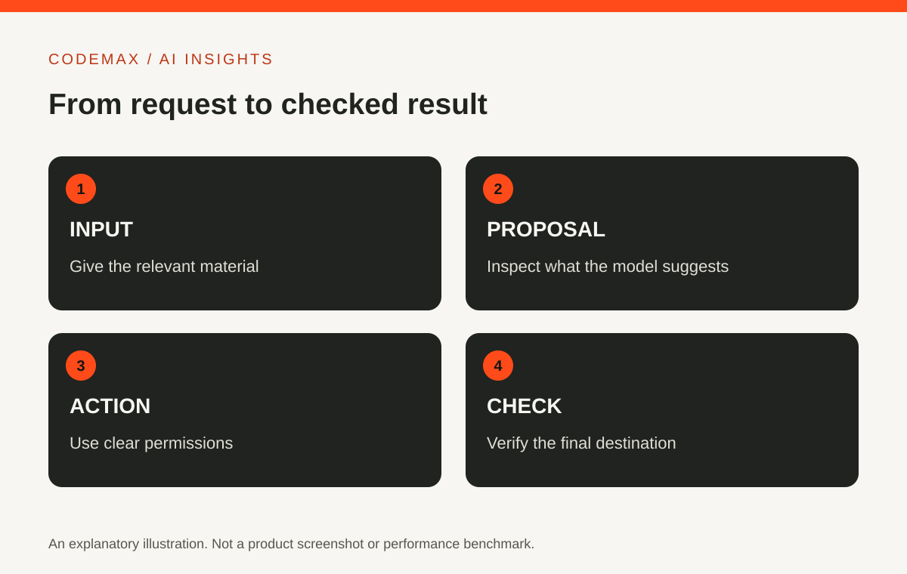

# Applied Artificial Intelligence: Turn an Idea into a Testable Project

Planned date (Australia/Sydney): 2026-10-06

Target keywords: applied artificial intelligence

SEO title: Applied Artificial Intelligence: A Practical Pilot | CodeMax

Meta description: Learn how applied artificial intelligence turns a defined problem into a measured experiment, with a baseline, evaluation examples and a clear stopping point.

Applied artificial intelligence means using AI methods to address a practical problem. The important work is connecting a capability to a useful outcome. A project becomes easier to evaluate when you can explain what goes in, what should come out and how you will know whether the result is better.

## Describe the problem without using the word AI
Try writing the problem as a task: finding a relevant document takes too long, repetitive notes need sorting, or images need consistent labels. This makes it possible to compare an AI approach with simpler alternatives.

If the task is mainly a fixed calculation or a clear rule, ordinary software may be sufficient. If it involves ambiguous language or patterns in varied data, an AI method may be worth investigating. The technology should follow the problem rather than define it.

## Establish a baseline
Measure how the task is handled now. Record time, errors and the work needed to correct them. Use representative examples, including difficult cases. Without a baseline, a polished prototype can feel successful without demonstrating an improvement.

For a small experiment, a simple record is enough: input, expected outcome, current method and observed problem. Keep the examples organised so you can use the same material when comparing approaches. Avoid changing both the task and the success measure halfway through the test.

## Define the role of the model
Decide whether the model proposes, classifies, summarises or acts. These roles need different checks. A proposed category can be reviewed before use; an action that changes a record needs permission and a way to recover from mistakes.

Describe what happens when the system is uncertain or fails. A useful fallback may be manual review, a clarification question or a clear message that no result is available. Silence and invented certainty are poor substitutes for a designed failure path.

## Evaluate the complete workflow
Include the steps around the model: preparing input, reviewing output, moving information and correcting errors. A model may be fast while the overall workflow remains cumbersome. The person using the result should be part of the evaluation.

NIST's AI guidance emphasises evaluation in context. In a pilot, that means asking whether the system works for the intended users and conditions. A benchmark from an unrelated task can inform your expectations, but it cannot replace this check. The AI Risk Management Framework is voluntary, and NIST says version 1.0 is being revised, so organisations using it formally should consult the current materials.

## Set a stopping point
Before expanding the project, decide what evidence would justify continuing. Also define what would make you revise the approach or stop. This prevents a small experiment from becoming a permanent obligation simply because effort has already been spent.

Write a short conclusion containing the observed benefit, remaining limitations and next decision. Keep estimates separate from measured results. Applied AI succeeds when it improves a real task in a way people can understand and operate, not merely when a demonstration contains an impressive model.

## Sources and further reading

- [NIST: AI Risk Management Framework](https://www.nist.gov/itl/ai-risk-management-framework)

Source-based explainer researched 6 October 2026. Examples are illustrative unless identified as reported research.

[Explore AI insights](https://codemax.com.au/blog/ai/)
