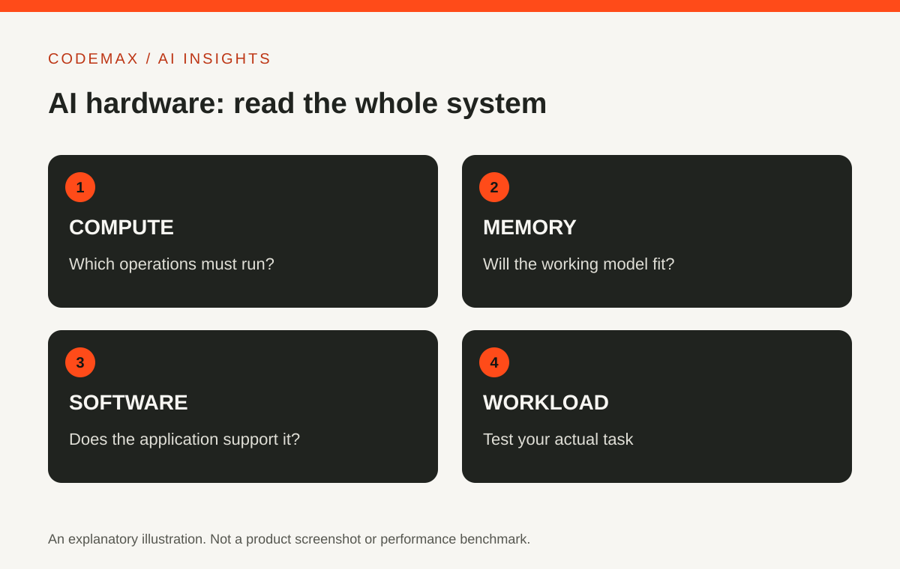

# Do You Need an AI Computer? Understand CPU, GPU and NPU First

Planned date (Australia/Sydney): 2026-10-07

Target keywords: ai computer

SEO title: AI Computer Guide: CPU, GPU and NPU Explained | CodeMax

Meta description: Understand what an AI computer can mean, how CPU, GPU and NPU roles differ, and why your software needs should guide a hardware decision.

An AI computer is a broad marketing label, not a guarantee that every AI task will run locally or quickly. Some computers include hardware intended to accelerate particular AI workloads. Whether that matters to you depends on the applications, models and features you actually plan to use.

## Start with where the work happens
When you use an online AI service, much of the processing may happen on the provider's infrastructure. Your computer handles the interface and related local work. Running a model on your own device creates a different set of hardware and software requirements.

Before considering an upgrade, list the applications you use and identify which features run locally. Check their official requirements. A feature described as AI-powered can still depend on an internet service, regardless of the label on the laptop.

## CPU, GPU and NPU have different roles
A CPU handles general computing tasks. A GPU is designed for highly parallel work and can support many AI workloads. An NPU is a processor designed to accelerate particular neural-network operations. Microsoft explains these roles in its Windows hardware guidance.

The presence of an NPU does not mean every AI application will use it. Software support and the type of computation matter. Similarly, a graphics card's usefulness depends on the model, memory requirements and supported software rather than the GPU name alone.

## Memory can matter as much as a headline number
A local model and its working data need usable memory. If the workload does not fit, performance or feasibility can change substantially. Check the application's requirements for the exact model and settings you intend to use.

Avoid comparing devices solely through a peak operations-per-second figure. Different precisions, workloads and measurement conditions can produce numbers that are not directly comparable. A real application test is more useful than assuming a larger headline number guarantees a better experience.

## Make a small workload checklist
Write down the task, software, model if relevant, input size and acceptable completion time. Add whether you need to work offline. This turns an abstract search for the best AI computer into a practical compatibility question.

If you can test before buying, use your own representative project. Check not only speed but also stability, noise, power use and the ability to complete other work at the same time. Record the settings so the comparison can be repeated.

## Upgrade for a demonstrated need
You may discover that your current computer already supports the online tools you use. Alternatively, a local creative or development workflow may justify more capable hardware. Both outcomes are reasonable when grounded in the actual workload.

This guide deliberately avoids a current shopping shortlist or price claim. Hardware options change quickly. Establish the requirements first, then compare devices against them so the words AI computer do not make the decision for you.

## Sources and further reading

- [Microsoft: CPU, GPU and NPU guide](https://www.microsoft.com/en-us/windows/learning-center/cpu-gpu-npu-windows)

Source-based explainer researched 30 September 2026. Examples are illustrative unless identified as reported research.

[Explore AI insights](https://codemax.com.au/blog/ai/)
