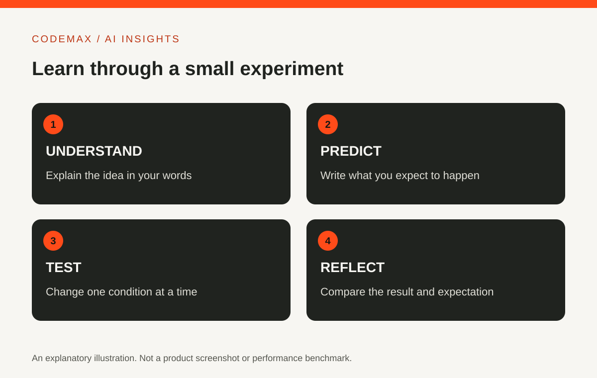

# Cognitive Class AI: Choose a Course You Will Actually Finish

Planned date (Australia/Sydney): 2026-10-18

Target keywords: cognitiveclass ai

SEO title: Cognitive Class AI: Plan Your Learning Path | CodeMax

Meta description: Explore Cognitive Class AI courses and build a realistic learning path around your goal, prerequisites, practice time and a small finished project.

Cognitive Class is an online learning platform with courses and projects covering subjects such as AI, data science and cloud computing. Searching for CognitiveClass AI can lead to a large catalogue. The useful first step is choosing a learning goal, not enrolling in every interesting course.

## Decide what you want to be able to do
A general introduction to AI serves a different purpose from learning to build a model. You might want to understand terminology, use generative tools more effectively or develop programming skills. Write a concrete outcome before choosing a course.

For example, explain the difference between training and inference is a manageable first goal. Build and evaluate a small classifier is a more technical one. Neither is inherently better; the right choice depends on your starting point and available time.

## Read the syllabus and prerequisites
Cognitive Class's catalogue includes introductory AI material, prompt engineering and other technical subjects. Check the individual course page for its current syllabus, format and requirements. The title alone may not tell you how much programming or mathematics is involved.

If a prerequisite is unfamiliar, spend time on it before proceeding. Skipping foundations can make later exercises feel harder than they need to be. Conversely, someone with relevant experience may not need to complete every introductory module in order.

## Budget for practice, not just watching
An estimated course duration is a guide, not a promise about your personal learning time. Leave room to repeat exercises, investigate errors and make notes. A video can feel clear while watching it but be difficult to reproduce without assistance.

After a lesson, close the instructions and explain the main idea in your own words. If there is a coding exercise, change a small part and predict what will happen. This makes the learning more active than simply reaching the final screen.

## Build one small result
Choose a project that demonstrates the concept you are learning. For an introductory course, that might be an illustrated explanation or a comparison of two approaches. For a technical course, it could be a reproducible notebook with a clear evaluation.

Keep the project small enough to finish. Record the source material, assumptions and limitations. A completed example you can explain is more useful than a large unfinished project assembled from steps you do not understand.

## Interpret certificates carefully
The platform advertises certificates and badges, but the exact requirements should be checked on the course page. Completing a course is not a guarantee of employment or equivalent to every form of accredited qualification. Its practical value depends partly on what you can demonstrate afterwards.

Choose the next course based on the gap revealed by your project. That creates a learning path connected to actual progress. The aim is a growing ability to understand and use AI, with a record of work you can discuss confidently.

## Sources and further reading

- [Cognitive Class: Course catalogue](https://cognitiveclass.ai/courses)
- [Cognitive Class: Learning platform](https://cognitiveclass.ai/)

Source-based explainer researched 30 September 2026. Examples are illustrative unless identified as reported research.

[Explore AI insights](https://codemax.com.au/blog/ai/)
