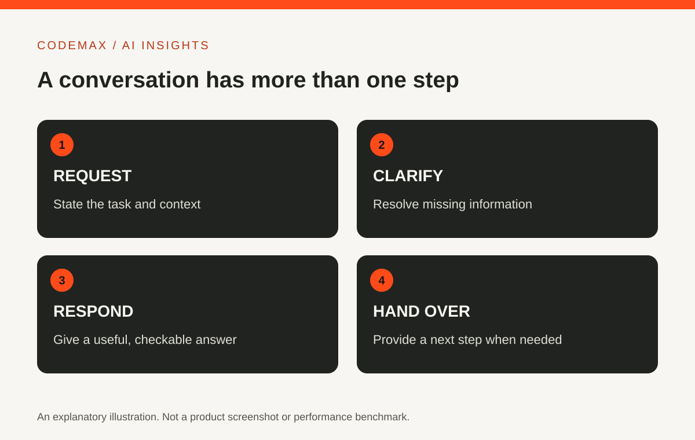

# Conversational AI: Why a Good Reply Is Only Half the Experience

Planned date (Australia/Sydney): 2026-10-26

Target keywords: conversational ai

SEO title: Conversational AI: How Useful Dialogue Works | CodeMax

Meta description: Learn how conversational AI handles dialogue, why context and handover matter, and how to test an assistant with realistic follow-up questions.

Conversational AI is technology designed to interact through language, often using text or speech. A useful conversation involves more than producing a plausible sentence. The system also needs to handle context, ambiguity and a sensible next step when it cannot help.

## Conversation is a sequence, not one answer
Consider someone asking about an exhibition, then asking whether it is accessible, and finally asking about Sunday. The later questions depend on information from earlier turns. A system that treats each message in isolation may answer about the wrong place or date.

IBM describes conversational AI as drawing on language-processing and machine-learning techniques. Products implement those capabilities in different ways: some follow defined flows, others generate flexible responses, and some combine both. A natural-sounding voice does not reveal which approach is underneath.

## Make ambiguity part of your test
Ask a question with more than one possible meaning. A useful system may request clarification rather than selecting an interpretation silently. Try correcting it in the next message and watch whether the correction carries through the conversation.

For example, say that you meant the evening session, not the morning one. Does the system update the relevant detail while preserving the rest? This exposes problems that a collection of isolated frequently asked questions may miss. Record the full exchange so another person can reproduce what happened.

## Check the boundary between knowledge and action
An assistant can explain how to change a booking without having permission to change it. Another may connect to a booking tool. The interface should make that difference understandable. A statement that a request is possible is not confirmation that the request was completed.

When a tool is involved, inspect the final state in the original system. Ask what happens if the tool fails or the session disconnects. A graceful failure message and a way to continue are part of the experience, not secondary technical details.

## Plan a human handover
For a public-facing service, identify situations that require a person. These might include disputed information, a repeated misunderstanding or a request outside the assistant's authority. The handover should preserve enough context that the user does not have to start again unnecessarily.

You can test this without creating real support work. Use a controlled scenario and check whether the interface offers a usable next step. Avoid reporting a successful handover solely because the assistant says a human will respond; confirm the request reaches the intended channel.

## Measure useful completion
Count whether people reach the right outcome, not simply how many messages the assistant generates. A short conversation with a clear answer may be better than a long, friendly exchange that circles around the problem. Review examples of failure alongside examples of success.

For everyday users, the same principle applies: treat conversation as a tool for completing a task. Ask follow-up questions, correct mistakes and verify important results. Fluency is valuable, but reliability depends on the entire interaction.

## Sources and further reading

- [IBM: Conversational AI](https://www.ibm.com/think/topics/conversational-ai)

Source-based explainer researched 30 September 2026. Examples are illustrative unless identified as reported research.

[Explore AI insights](https://codemax.com.au/blog/ai/)
