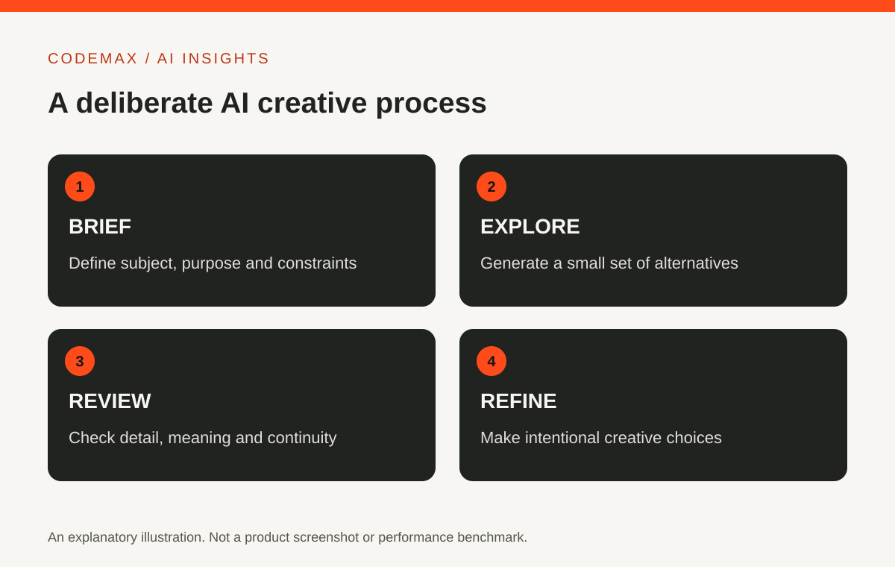

# WOMBO Dream AI: Turn a Vague Idea into a Clear Image Brief

Planned date (Australia/Sydney): 2026-11-03

Target keywords: wombo dream ai

SEO title: WOMBO Dream AI: An Image Brief and Review Guide | CodeMax

Meta description: Explore WOMBO Dream AI with a practical image-brief method covering subject, composition, lighting and review, without confusing an illustration with a photograph.

WOMBO Dream is presented as an AI art generator. If you want to explore it, start with the provider's official links and current app listing. Features and access conditions can change, so this guide focuses on building and evaluating an image brief rather than promising a particular button, style or free allowance.

## Describe one clear visual idea
Start with the subject and what it is doing. Then add the setting, composition and lighting. A request for something amazing gives the system little direction; a description of a ceramic bowl on a wooden table beside a soft window light communicates a scene.

Keep the first brief manageable. Adding many unrelated visual references can make it difficult to identify why a result worked or failed. You can develop the image through revisions once the main composition is close to what you intended.

## Decide how the image will be used
A phone wallpaper, a presentation illustration and a website banner need different framing. Describe where the important subject should sit and whether space is needed for separate text. Check the actual export dimensions and format offered by the current product.

Do not assume that a preview is ready for print or every screen size. Open the downloaded file and inspect it at the size you intend to use. A composition that looks good as a thumbnail may contain distracting details when enlarged.

## Change one instruction at a time
If the lighting is wrong, revise the lighting before changing the subject and setting as well. Keep a record of the brief and the result. This makes experimentation more intentional and helps you identify which instructions communicate your idea clearly.

Variation is part of generative image work. A similar prompt may produce a different image, and not every detail will follow the brief. Judge the actual result rather than assuming the written request guarantees what appears in the output.

## Inspect the parts people notice first
Look closely at faces, hands, object relationships, reflections and any generated lettering. Check whether perspective and lighting agree across the scene. If an image implies a real event or person, consider whether its presentation could mislead viewers.

For informational graphics, add verified text and precise measurements separately with an appropriate design tool. A visually convincing generated chart is not a reliable way to communicate exact data. Use generative imagery for illustration, not as evidence.

## Check the terms for your intended use
Review the provider's current terms and the rights associated with any input images. This article does not establish permission for a particular commercial project or make a legal claim about generated output.

A productive creative session ends with an image you have inspected and a clear understanding of how it will be presented. Treat the tool as part of a design process: brief, generate, review and refine. The finished work still benefits from your visual judgement.

## Sources and further reading

- [WOMBO: Official product links](https://wombo.com/m/home)
- [WOMBO Dream: Publisher app listing](https://play.google.com/store/apps/details?id=com.womboai.wombodream)

Source-based explainer researched 30 September 2026. Examples are illustrative unless identified as reported research.

[Explore AI insights](https://codemax.com.au/blog/ai/)
