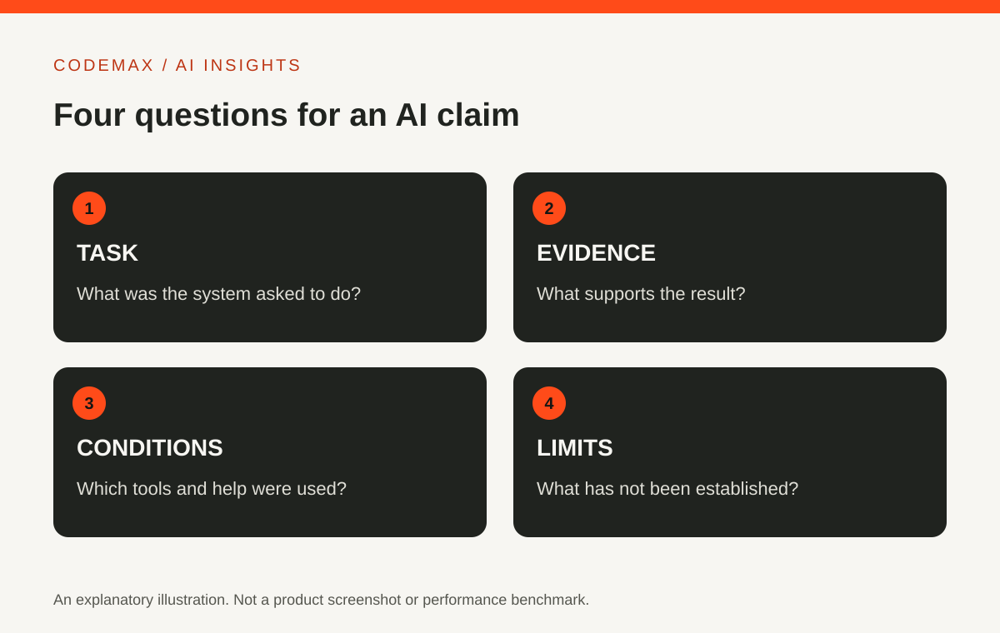

# Claude AI: A Practical First Project for New Users

Planned date (Australia/Sydney): 2026-11-09

Target keywords: claude ai

SEO title: Claude AI: A Practical First Project | CodeMax

Meta description: Explore Claude AI through a small writing and analysis project, with guidance on context, verification and the difference between a draft and a completed action.

Claude is an AI assistant developed by Anthropic. Its official material describes uses including writing, analysis, coding and working with information. For a new user, a small project you can evaluate is a better introduction than trying every feature at once.

## Start with a document you understand
Choose a short, non-sensitive piece of writing, such as your own notes for an event or a draft article. Ask Claude to identify the main points and any missing information. Compare the response with what you actually wrote.

This gives you a way to observe useful behaviour and mistakes. If you begin with a topic you cannot assess, fluent output may be difficult to distinguish from accurate output. Familiar material makes the first experiment more informative.

## Explain the purpose of the work
Give the intended audience and result. For example, ask for an event description for people attending for the first time, with a short paragraph followed by practical details. Specify which facts must remain unchanged.

Ask for uncertainty to be visible. If the source notes do not include a time or venue, the draft should not invent one. You can use clearly marked placeholders while gathering the missing details, then verify the completed version before publishing it.

## Review structure and facts separately
First check whether the draft communicates the main idea clearly. Then compare factual details against the source. This two-pass review helps you avoid accepting an incorrect date simply because the wording reads well.

For analysis tasks, ask the assistant to point to the part of the supplied material supporting its conclusion. Inspect that material yourself. A plausible interpretation is still an interpretation, especially when the source is incomplete or ambiguous.

## Explore additional features deliberately
The features available in Claude depend on the current product and account. Use Anthropic's official documentation to confirm supported interfaces and capabilities. Do not assume that a tutorial using one model or plan matches your own setup.

If a feature creates files or connects to another tool, begin with a disposable example. Check what was saved, where it went and what permissions were used. This is more useful than granting broad access before understanding the workflow.

## Keep a useful record of the experiment
Save the original notes, the instruction and your corrected result. Note what Claude helped with and what required your judgement. If you later compare another assistant, use the same task and make the comparison conditions explicit.

This article is an introductory workflow, not a hands-on benchmark or a claim that Claude is best for every use. The aim is to help you form your own evidence from a bounded task. A good first project leaves you with a useful result and a clearer understanding of what to check next.

## Sources and further reading

- [Anthropic: Meet Claude](https://www.anthropic.com/claude)
- [Anthropic: Things you can use Claude for](https://support.anthropic.com/en/articles/7996845-what-are-some-things-i-can-use-claude-for)

Source-based explainer researched 30 September 2026. Examples are illustrative unless identified as reported research.

[Explore AI insights](https://codemax.com.au/blog/ai/)
